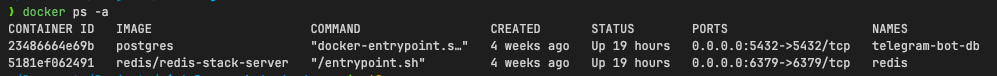

### Telegram AI agent bot starter code

This repository contains a simple starter code for creating a Telegram bot that integrates with an AI agent. 
The bot can respond to user messages using AI-generated responses. This code does all the groundwork of setting up the
Telegram bot and AI agent. 

The following technologies are used in this project:

- Python
- FastAPI
- PostgreSQL
- Redis
- Docker
- Langgraph (for AI agent)
- [Aiogram](https://aiogram.dev) (for Telegram bot)
- Ngrok (for local development)

### Prerequisites

- Python 3.13+
- Docker
- Uv [Installation guide](https://docs.astral.sh/uv/getting-started/installation/)
- Ngrok [Getting started](https://ngrok.com/docs/getting-started/)

### Running the project

1. Clone the repository and prepare the virtual environment

```shell
uv venv
source .venv/bin/activate
uv sync
```

2. Prepare the dependencies (Postgres and Redis)

```shell
cd dependencies
docker-compose up -d
```

if everything is set up correctly, you should see the following output:


3. Set up environment variables.

Copy the `.env.example` file to `.env` and set the required environment variables.

```shell
cp .env.example .env
```

This configuration already includes postgres and redis credentials for local development.

4.Setting up ngrok tunnel

This is needed for local development to expose you bot to the internet, so telegram servers can reach it.

Follow the [Ngrok quickstart](https://ngrok.com/docs/getting-started/)

Set up the permanent domain on the [ngrok dashboard](https://dashboard.ngrok.com/domains).
This will help you to avoid changing configuration every time the tunnel is restarted.

Run ngrok 

```shell
ngrok http 8000 --url <YOUR DOMAIN>
```

Copy the domain address and paste it to the TELEGRAM_WEBHOOK_URL value in the.env file.


4. Set up the bot

Follow the [Guide](https://arabind-meher.medium.com/creating-a-telegram-bot-with-botfather-a-step-by-step-guide-605e954de647)

After creating the bot, copy bot token to and paste it to TELEGRAM_BOT_TOKEN value in .env file.

5. Configuring OPENAI API key

Create an account on [OpenAI](https://platform.openai.com/account/api-keys) and copy the API key to the OPENAI_API_KEY value in .env file.

6. Run the bot

```shell
uv run fastapi dev src/main.py 
```


